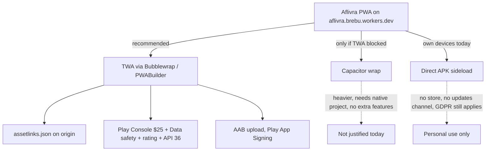

# RESEARCH — Aflivra: Android/iOS marketplace publishing + GDPR compliance (map-compliance-analysis)

Read-only analysis session, 2026-10-07. Repo: `/Users/cbrebu/Projects/alfivra` (worktree `main`).
Research agent: Scribe. Sources: repo code (all claims carry `file:line`) + official docs fetched this session
(Chrome, Cloudflare, Apple, Google Play help — list at the end; fetch budget respected).

---

## Scribe Findings

### 0. Verified repo facts (the ground everything below is built on)

| Fact | Evidence |
| --- | --- |
| **PWA**, deployed as Cloudflare Worker `aflivra` on `aflivra.brebu.workers.dev`, **no custom domain** | `scripts/deploy.mjs:4` (`WORKER_NAME='aflivra'`), `:34` (prints workers.dev URL); `scripts/relay-flights.mjs:5` (`SEED_BASE_DEFAULT='https://aflivra.brebu.workers.dev'`) |
| Manifest is install-ready: `display: standalone`, `lang: ro`, `id: "/"`, icons **192+512, both `purpose: "any maskable"`** | `public/manifest.webmanifest`; linked from `app/layout.tsx:14`; `appleWebApp` capable + `apple-touch-icon.png` (`app/layout.tsx:16-22`) — iOS "Add to Home Screen" already works |
| Service worker with **fetch handler** (installability criteria pass) + Web Push `push`/`notificationclick` handlers | `public/sw.js:8-21`; registered at `app/page.tsx:76` |
| **No manifest `screenshots`, `shortcuts`, `categories`, `display_override`** (missing richness — only cosmetic) | `public/manifest.webmanifest` |
| **No `/.well-known/` in `public/`** → Digital Asset Links file for TWA does not exist; any file dropped in `public/` ships as a Worker asset (exact-match serving, assets run before the Worker) | `glob public/.well-known` empty; `dist/server/wrangler.json` `assets:{directory:"../client"}`; `scripts/deploy.mjs:11` preserves `config.assets` |
| **Geolocation**: `watchPosition`, client-side; coarse position leaves the browser only toward our own API — **2 decimals (~1.1 km)** for weather, **3 decimals (~110 m)** for geo-context params | `app/location.tsx:25-33`; `app/local-weather.tsx:9` (`lat:center.lat.toFixed(2)`); `lib/geographic-scope.ts:18` (`toFixed(3)`); validated server-side `app/api/weather/route.ts:6`, `app/api/transport/route.ts:6`, `app/api/places/route.ts:8` |
| **Coordinates are never persisted**: localStorage stores only mode/manual city (`app/location.tsx:19,24,31,35`); D1 has **no column or table** for position | `drizzle/0000_thin_demogoblin.sql` (5 tables: `source_budget`, `source_cache`, `watch_items`, `watch_events`, `push_subs`) |
| Refusing location degrades gracefully (falls back to Romania/Bucharest; app fully usable) | `app/location.tsx:30-32` |
| **Anonymous install UUID** (`crypto.randomUUID`, created lazily on first watch action, zero account/PII) | `app/install-id.ts:1-38` |
| **Watch data in D1**: kinds `dosar, firma (CUI), localitate, act, venue, meteo`; caps 100 items/install, 5 push subs/install; **no automatic retention — rows live until manual purge** | `lib/live/watch-sweep.ts:21,38,66-82,111-124`; schema `drizzle/0000_thin_demogoblin.sql:21-57` |
| **Push**: VAPID P-256 keys are wrangler secrets; subs stored (endpoint+p256dh+auth); hourly sweep sends changes; subs auto-deleted only on 410/gone | `.dev.vars.example:4-7`; `lib/live/watch-sweep.ts:13,283-289` |
| **„Șterge-mi datele" exists**: confirm → deletes `watch_items` + `watch_events` + `push_subs` for the install, resets local identity | `app/watch-center.tsx:93,125`; `app/api/watch/purge/route.ts`; `lib/live/watch-sweep.ts:126-130` |
| localStorage keys (all local, user-clearable): `aflivra.install.v1`, `aflivra.location.v1`, `aflivra.law-bookmarks`, `reper.v2.preferences/saved/plan` | `app/install-id.ts:6`, `app/location.tsx:13`, `app/legal-workspace.tsx:49`, `app/page.tsx:75-78` |
| **No cookies at all**; **zero analytics/trackers/ads/payments/accounts** (grep for gtag/GTM/fbq/segment/matomo/etc. → only false positive is transit-vehicle "telemetry" text) | greps over `app/` this session; `app` grep `Set-Cookie|document.cookie` → nothing; `README.md:110` ("fără cont… plăți sau reclame") |
| AI editorial images **labeled** (hero derivată, 14 category illustrations "ilustrații AI" with prompts/checksums); real photos carry Wikimedia author+license | `app/page.tsx:121`; `README.md:120`; `public/media/category-illustrations.json`, `public/media/manifest.json` |
| **No privacy policy, no TOS, no contact/operator page, no in-app legal links** (only 2 pages exist: `/` and `/catalog`) | `glob app/**/page.tsx` → 2 files; grep `confidentialitate|Termeni|privacy` in `app/` → nothing |
| Site is deliberately `noindex` | `app/layout.tsx:15` |
| Forecast fetches run **server-side in the Worker** (rounded coords go Worker→Open-Meteo, not browser→Open-Meteo) | `app/api/weather/route.ts:6` + `readSource` D1-cache pipeline (`lib/live/cache.ts`) |
| D1 database name `aflivra`; **region/location not recorded anywhere in the repo — undetermined** (created via `wrangler d1 create`, automatic location) | `scripts/db-migrate.mjs:7,11`; `scripts/deploy.mjs:11` resolves id at deploy; no `--location`/`--jurisdiction` in repo history |

---

### 1. Android path

Three honest options for **this** PWA (next.js-on-Workers, no native code, single origin):

#### Option A — TWA via Bubblewrap / PWABuilder (RECOMMENDED)

The canonical PWA→Play path. A Trusted Web Activity is a Chrome-protocol wrapper app: content is rendered by the
user's browser (no webview), the APK is tiny, and the app↔site link is verified with **Digital Asset Links**
(Chrome TWA docs, fetched). Bubblewrap is the CLI that generates the Android project from the manifest
(Node 18+; Apache-2.0; **PWABuilder uses Bubblewrap's core under the hood** — same output, GUI vs CLI).

What it needs from **our repo**, concretely:

1. **Digital Asset Links on the served origin.** `/.well-known/assetlinks.json` with the SHA-256 cert fingerprint
   of the Play-App-Signing key and `namespace/package_name` of the app. Our deploy fully controls this: drop the
   file in `public/.well-known/assetlinks.json` → it ships as a Worker asset and is served at the exact path
   (assets are matched before the Worker runs; `robots.txt`/`manifest.webmanifest`/`sw.js` are already served this
   way). No route code needed. **Two-pass flow**: the fingerprint only exists after Play App Signing issues the key
   (first internal-test upload), so: `bubblewrap init/build` → upload AAB to internal testing → read SHA-256 from
   Play Console (App integrity / bundle explorer) → publish assetlinks → rebuild/verify. If verification fails,
   Chrome falls back to a Custom Tabs UI with the URL bar visible.
2. **PWA quality**: already passes — 192+512 icons incl. maskable, standalone, start_url, **SW with fetch handler**
   (`public/sw.js:8`). TWA content is expected to meet Add-to-Home-Screen criteria (Chrome docs). Optional polish:
   add `screenshots` to the manifest (richer install UI; not a gate).
3. **Play Console**: one-time **$25** registration; **new personal developer accounts** additionally go through
   Google's app-testing requirement — a closed test with at least ~12 testers opted in for ~14 days before
   production (Play Console Help topic "App testing requirements for new personal developer accounts", linked from
   the Console help index; numbers [not re-fetched this session] — verify in Console when the account exists) —
   plus device verification for the new account.
4. **Data safety form** (required for all apps): declare *Location → Approximate* (app functionality — our 2-3dp
   coarsened coords to our own API), *Device or other IDs* (install UUID, app functionality), **no data shared**,
   not linked to identity, encrypted in transit (HTTPS), user-initiated deletion = the existing „Șterge-mi datele".
   **Privacy policy URL is mandatory** — no page exists yet (§3).
5. **Content rating (IARC)** questionnaire — reference/informational app; trivial.
6. **Target API level**: since **Aug 31, 2026 new apps must target Android 16 / API 36** (Play Console Help,
   fetched this session). Bubblewrap tracks current SDKs but **verify `targetSdkVersion` = 36 in the generated
   project** before upload.
7. **App signing**: Play App Signing (default). Keep the upload key out of the repo.
8. **Listing kit (RO)**: title ≤30 chars ("Aflivra" fits), description RO, ≥2 screenshots + 1024×500 feature
   graphic (missing), reply-able support contact. Screenshot infrastructure already exists
   (`scripts/visual-compare.mjs:39` shoots the deployed app at phone width) — reuse it for store screenshots.

**Effort**: assetlinks + verification loop 0.5–1 d · Bubblewrap packaging + signing 0.5 d · Console account,
listing, Data safety, rating, internal/closed testing 1–1.5 d → **≈ 2–3 active days + ~14-day closed-test wait**
(new personal account).

#### Option B — Capacitor wrap (NOT recommended now)

Ships the whole JS bundle inside an APK via a WebView; needs a real native project (Android SDK/Gradle, updates
forever). For Aflivra it adds **nothing the TWA doesn't already give** (no native APIs needed, no camera/NFC/…),
loses Chrome's shared runtime (bigger APK, stale WebView risk), and still requires the same Play paperwork.
Choose only if Play/assetlinks verification becomes a genuine blocker (e.g. domain without DNS control — not our
case; we control the Worker completely).

#### Option C — Direct APK sideload (fits "user has developer mode")

`bubblewrap` also emits a signed APK; sideload it without any store. Zero store requirements, but **GDPR still
applies in full**, there is no update channel, and the TWA still needs assetlinks for the URL bar to disappear.
Perfectly fine for the developer's own devices today; not a distribution strategy.

> **Android recommendation: Option A (TWA via Bubblewrap), starting now.** Inventory of what the repo must grow:
> `public/.well-known/assetlinks.json`, a bubblewrap project config in `scripts/` (matches the repo's script
> culture; PWABuilder's GUI if preferred), targetSdk 36 check, Play listing kit (RO copy + screenshots from the
> existing visual tooling + 1024×500 feature graphic), and the privacy-policy URL (§3 — it gates the submission).

---

### 2. iOS path

#### The honest review risk: rule 4.2

Apple's App Review Guidelines (fetched this session) say it plainly:

- **4.2 Minimum Functionality** — "Your app should include features, content, and UI that elevate it beyond a
  repackaged website. If your app is not particularly useful, unique, or 'app-like,' it doesn't belong on the App
  Store."
- **4.2.7(e)** — "Thin clients for cloud-based apps are not appropriate for the App Store."

A transparent Capacitor/WebView wrapper of `aflivra.brebu.workers.dev` is exactly the shape 4.2 targets. Aflivra
would be submitted with **zero native-added functionality** — everything (offline, watch, push, geolocation)
already runs as web APIs inside the wrapper. Rejections here are common and re-review loops are slow. Mitigating
4.2 requires genuinely native value (native tab bar, native share targets, widgets, App Intents/Shortcuts), which
is a real product project, not a packaging task.

#### Apple itself points at the alternatives

The same guidelines page (introduction) states: "If you build an app that you just want to show to family and
friends, the App Store isn't the best way to do that… use Xcode to install your app on a device for free or use
Ad Hoc distribution available to Apple Developer Program members." And: "there is always the open Internet… we
provide Safari for a great web experience too."

#### What iOS already gives Aflivra without a store

- **Add to Home Screen works today**: `appleWebApp.capable`, `apple-touch-icon.png` (`app/layout.tsx:16-22`),
  standalone manifest. Icon + splash come for free.
- **Web Push works on installed home-screen web apps since iOS 16.4** — Aflivra's standard Web Push + VAPID flow
  (`app/watch-center.tsx:171-202`, `public/sw.js:9-13`) is exactly the API iOS exposes there. So notifications —
  the one capability usually cited as "needs a native app" — is already covered through the browser.
- Only documented friction: teaching users the Share → "Adaugă la ecranul principal" step; an in-app hint on iOS
  Safari costs an afternoon.

#### If the App Store is attempted anyway (costs, no Mac required)

| Item | Cost / fact |
| --- | --- |
| Apple Developer Program | **$99/year** (individual account is fine — 5.1.1(ix) "legal entity" concerns apply to regulated fields: banking/health/gambling — a public-open-data reference app is not that) |
| Build without a Mac | Codemagic (cloud Macs; free tier ~500 build min/mo — [not re-fetched this session]) or **GitHub Actions macOS runners**: private repo rate **$0.062/min ≈ 10× Linux** (fetched: Linux $0.006 / macOS $0.062; GitHub Free plan includes 2,000 min/mo → ≈ roughly 300 macOS minutes of real usage at rate-parity, i.e. ~10–15 Capacitor builds/month; **public repos get standard runners free**, incl. macOS) |
| Free sideload alternative (own devices) | Free Apple ID provisioning via Xcode: 7-day expiry, ~3 apps/device; renewing is friction; TestFlight + Ad Hoc (100 devices) need the $99 account |
| App Privacy "nutrition labels" | Declare: **Location → Approximate → App Functionality → not linked to identity → no tracking**; **Identifiers (Device ID) → App Functionality → not linked → no tracking**; nothing else, nothing shared for tracking |
| ATT prompt | **Not needed** — no tracking, no cross-app/site identifiers, no third-party SDKs; ATT is for "tracking across apps/websites", which Aflivra does not do (zero trackers verified) |
| Guideline gates for our shape | 5.1.1(i) privacy-policy link in **App Store Connect metadata AND in-app**, incl. retention/deletion description; 1.5 developer contact/support URL; 2.3 accurate screenshots; 4.5.4 push must be opt-in (it is — explicit subscribe in watch center) with an off switch (unsubscribe exists, `app/watch-center.tsx:199-202`); 5.1.5 location consent + purpose (browser prompt already; add the in-app purpose wording) |

> **iOS recommendation: ship "Add to Home Screen" officially (no store).** Document an iOS install guide + hint;
> the app keeps notifications via iOS 16.4+ Web Push. Revisit the App Store only with a deliberate product
> decision to build native value (4.2) and budget for a possible rejection — the $99 + build pipeline +
> labels + listing are the cheap part; the review risk is the expensive part. Ad Hoc / TestFlight ($99) is the
> honest middle ground if real devices of friends/family need it before any store decision.

---

### 3. GDPR / ANSPDCP (Romania context) — what Aflivra actually processes, and what's missing

Controller: the individual developer (Operator). Supervisory authority: ANSPDCP
(Autoritatea Națională pentru Supravegherea Prelucrării Datelor cu Caracter Personal / ansedsdp.ro).
RO specifics: GDPR applies directly (Reg. (EU) 2016/679); ePrivacy rules (Directive 2002/58/EC, **Art. 5(3)** —
storing/accessing information on terminal equipment requires informed consent unless strictly necessary for an
explicitly requested service) are transposed by **Law 506/2004**; ANSPDCP has issued cookie-consent guidance and
can fine controllers.

#### 3.1 The processing inventory (mapped to code)

| Data | Where | Leaves device? | Stored server-side? | Legal base (honest read) |
| --- | --- | --- | --- | --- |
| Precise geolocation (browser API) | `app/location.tsx` | only **coarsened** (2dp ≈1.1 km to `/api/weather`; 3dp ≈110 m via `geographicParams` to ~APIs accepting geo context) | **No** — no D1 column/table; `source_cache` keys cache the public forecast, not the user | Consent (OS/browser permission prompt, explicit button; app works fully without it) |
| Install UUID (random, per install) | `app/install-id.ts` | yes, with watch API calls | `watch_items.install_id`, `watch_events.install_id`, `push_subs.install_id` | Consent for service provision; *strictly necessary* exemption credible because it is created lazily on the first watch action (the explicitly requested service) |
| Push subscription (endpoint + p256dh + auth) | `app/api/watch/subscribe/route.ts` | yes | `push_subs` | Explicit consent (user taps subscribe; Apple 4.5.4 & ePrivacy aligned) |
| Watch items: dosar numbers, CUI, locality, act, venue | `lib/live/watch-sweep.ts:21` | yes | `watch_items` (+ signup payloads in `watch_events`) | Consent (each watch is an explicit user action) — **note these are user-relatable even though the underlying data is public** (they reveal which court cases/companies a person follows → treat as personal data) |
| Ride/event/history feed of watch changes | `watch_events` | yes | until manual purge | as above |
| Preferences, saved places, plan, law bookmarks | localStorage | no | no | strictly-necessary-style functional storage; no consent banner needed while zero analytics/trackers (verified) |
| Request IPs / timestamps (Cloudflare edge + Workers logs) | platform | n/a | platform logs, short-lived | Legitimate interest (security/abuse), disclose in policy |

Key design strengths that **keep** (they reduce GDPR surface): no accounts (nothing to link across sessions),
lazy UUID, coarsened coordinates transmitted, coordinates never persisted, complete per-install purge with
identity reset, graceful degradation when location is refused (`app/location.tsx:30-32`).

#### 3.2 The gaps (all fixable, none architectural)

1. **No privacy policy page** — GDPR Art. 13 requires *at collection time*: controller identity + contact,
   purposes, legal bases, recipients, transfers, retention period/criteria, rights (access/rectification/erasure/
   restriction/objection/portability), right to withdraw consent, right to complain to the supervisory authority
   (fetched text this session). This page is **also the single blocker both stores require** (Play privacy-policy
   URL; Apple 5.1.1(i)). → create `/confidentialitate` (Romanian primary; EN optional) containing exactly the
   Art. 13 list, **with facts that are true of this codebase** (the table above is 90% of the draft).
2. **D1 location undetermined — must decide before the policy's transfer section is honest.** Cloudflare D1
   (fetched, docs current as of 2026-10-02): automatic placement near creation origin; `--location` hints
   (weur/eeur) are *best-effort*; **`--jurisdiction=eu` exists but can only be set at creation and cannot be added
   later** (EU: primary + any read replicas stay in the EU). Action: `corepack pnpm exec wrangler d1 info aflivra`
   → if not EU, either (a) recreate with `--jurisdiction=eu` and migrate the 5 tables (export/import; VAPID
   secrets unchanged; deploy script resolves db id automatically — `scripts/deploy.mjs:11`), or (b) document the
   transfer under Cloudflare's DPA (SCCs / EU-US DPF) in the policy. Decide once, write it down.
3. **Retention is undefined (flagged by Art. 13(2)(a))** — currently `watch_items`/`watch_events`/`push_subs` live
   until the user purges. Options: state "until deleted by you, plus automatic deletion after N months of
   inactivity" and implement the sweeper pruning in `watch-sweep` (`checked_at` already exists as an activity
   signal on items; events can be pruned by `created_at`). Small code + one honest sentence in the policy.
4. **No operator contact** — Art. 13(1)(a) needs contact details; stores need a support URL (Apple 1.5). → a
   contact line (email) on `/confidentialitate` + footer link. One decision: which email.
5. **In-app information layer at first use** — consent *UX* is already explicit (browser prompts, explicit
   subscribe/watch buttons); what's missing is the *information* next to them: a one-line notice by the watch/push/
   location controls ("ce se salvează, cui, cât, cum ștergi — Detalii") linking the policy. **Honest verdict: no
   cookie-style banner is needed** — zero trackers/analytics, no non-essential cookies, and the remaining storage
   is functional-by-request; document that analysis inside the policy so it's defensible.
6. **Records/Art. 30** — RO has no small-controller exemption to keep no records; keep a 1-page register in-repo
   (the table in §3.1 is basically it).
7. **Breach process lite** — Art. 33/34: 72 h to ANSPDCP; a short runbook (what counts, who to email, template)
   in-repo is proportionate.
8. **Cloudflare = processor** — accept Cloudflare's Data Processing Addendum (self-serve in the dashboard) to
   close Art. 28.
9. **TOS page** — not legally forced by GDPR (no accounts/contracts/payments), but stores expect a usage page and
   it's cheap; declare data source attribution + "informational, verificate la sursă" framing there (the open-data
   attribution already lives in `public/data/sources.json` + per-source manifests).

#### 3.3 What is NOT a problem (checked, don't spend time)

- AI Act: no deployed AI system serving users (editorial images are static, generated offline, labeled).
- Open-Meteo receives rounded coordinates **from the Worker's IP**, not the user's (server-side `readSource`
  pipeline) — mention as a recipient of approximate location in the policy, low risk.
- ANSPDCP notification/registration: no general registration duty for controllers; records on request (§ 3.2.6).

### 4. Store data declarations (pre-filled answers)

**Play Data safety (for the TWA)** — collected: `Location → Approximate → App functionality → not shared → not
linked to identity → encrypted in transit → deletion on request`; `Device or other IDs → App functionality → not
shared → not linked → deletion on request`. Nothing else. Security section: data encrypted in transit (HTTPS only,
Workers enforce), deletion via „Șterge-mi datele". **Apple App Privacy labels (if ever shipping to iOS)** —
`Location: Approximate, App Functionality, not linked, no tracking`; `Identifiers: Device ID, App Functionality,
not linked, no tracking`; no other categories; no tracking declaration; **no ATT prompt** (no tracking).

### 5. What exists vs. what's missing

| Artifact / capability | Exists? (file:line) | Needed for | Effort |
| --- | --- | --- | --- |
| Installable manifest, maskable 192+512 icons, standalone | ✅ `public/manifest.webmanifest` | Play(TWA) / iOS(A2HS) | – |
| SW with fetch handler + push handlers | ✅ `public/sw.js:8-21` | both | – |
| Apple A2HS meta + touch icon | ✅ `app/layout.tsx:16-22` | iOS | – |
| `/.well-known/assetlinks.json` | ❌ | **Play (blocker)** | 0.5–1 d (two-pass cert fingerprint flow) |
| Bubblewrap/TWA project in repo, targetSdk **36** check | ❌ | **Play (blocker)** | 0.5 d |
| Play Console acct + $25 + closed-testing gauntlet | ❌ | **Play (blocker)** | external + ~14 d wait |
| Store listing kit (RO copy, screenshots, 1024×500 feature graphic) | ⚠️ screenshots infra exists (`scripts/visual-compare.mjs:39`); assets ❌ | Play | 0.5–1 d |
| Data safety answers (Play) / Privacy labels (Apple) | ❌ (answers drafted in §4) | **Play (blocker)** / iOS-if-shipped | 0.25 d |
| Content rating (IARC) questionnaire | ❌ | **Play (blocker)** | 0.25 d |
| **Privacy policy page `/confidentialitate` (RO, Art. 13 content)** | ❌ | **GDPR (blocker) + Play (blocker) + Apple 5.1.1** | 1 d (incl. decisions below) |
| **D1 location determination (+ optional `--jurisdiction=eu` recreate)** | ❓ undetermined | **GDPR (policy gate)** | 0.25 d check / 0.5–1 d migrate |
| Retention policy + auto-prune sweeper (watch data) | ❌ (manual purge only) | GDPR | 0.5 d code + policy line |
| Operator contact (email) + footer legal links | ❌ | GDPR + Apple 1.5 + Play support URL | 0.25 d |
| First-use info notices (watch/push/location) linking policy | ❌ (consent UX ✅, info layer ❌) | GDPR | 0.5 d |
| TOS page `/termeni` | ❌ | stores expectation | 0.5 d |
| Art. 30 processing register (internal) | ❌ | GDPR (on request) | 0.25 d |
| Breach runbook (internal, 72 h ANSPDCP) | ❌ | GDPR | 0.25 d |
| Cloudflare DPA acceptance | ❓ (assume not) | GDPR Art. 28 | 0.25 d |
| Apple Developer $99 + iOS build pipeline + labels + 4.2 mitigations | ❌ | iOS-store path only | $99/yr + 1–2 d + high rejection risk |
| iOS install guide / in-app A2HS hint | ❌ | iOS (recommended path) | 0.25 d |

### 6. Compliance checklist, ordered by blocker-ness

1. **Determine D1 location** (`wrangler d1 info aflivra`) → decide EU-jurisdiction recreate vs. documented DPA
   transfer. *(Everything in the privacy policy depends on this sentence.)*
2. **Write `/confidentialitate`** (RO; Art. 13-complete; contains the §3.1 table as prose; states retention +
   „Șterge-mi datele" + rights + ANSPDCP complaint right). *Gates both store submissions.*
3. **Operator contact + footer legal links** (Confidentialitate · Termeni · Contact).
4. **Retention sweeper + first-use notices** (code, small).
5. **TOS page** + internal register + breach runbook.
6. **Android shipment**: assetlinks → Bubblewrap (targetSdk 36) → Play Console ($25, data-safety §4, IARC,
   listing kit screenshots from existing tooling, feature graphic) → internal test → closed test (12 testers/14 d
   if new personal account) → production.
7. **iOS**: publish the A2HS install hint; App Store only as a deliberate later bet (4.2 risk, Apple's own
   guidance favors the web for this shape; Ad Hoc/TestFlight at $99 if needed).

**Totals (active work)**: GDPR web pages + code items ≈ 3–4 d · Android packaging + Play paperwork ≈ 2–3 d ·
iOS A2HS hint 0.25 d · **≈ 6–8 working days** + external calendar waits (Play ~14-day closed testing) + $25
one-time (+ optional $99/yr Apple, optional Codemacic/GH-minutes CI cost at ~10× Linux rate on private repos).

### 7. Recommendations (one line each)

- **Android: TWA via Bubblewrap** — the repo already satisfies PWA quality; add assetlinks on the Worker, package
  with Bubblewrap at targetSdk 36, complete Play's Data safety form with the §4 answers. Capacitor unjustified;
  sideload only for personal use.
- **iOS: no store for now** — ship the A2HS guide (notifications already work via iOS 16.4+ Web Push); revisit
  App Store only alongside a real native-feature plan (4.2), with TestFlight/Ad Hoc as the $99 middle ground.
- **GDPR: 2 pages + 1 decision + 3 small code touches** — `/confidentialitate` + `/termeni`, decide D1 location,
  retention sweeper, contact line, first-use notices. No cookie banner is needed (zero trackers — verified), and
  the existing consent UX + purge flow are already Art. 7/17-ready.

### 8. Sources consulted this session (fetches ≤20, official pages preferred)

- Chrome Developers — Trusted Web Activity overview (TWA/Digital Asset Links/quality criteria): developer.chrome.com/docs/android/trusted-web-activity/
- GitHub — GoogleChromeLabs/bubblewrap README (CLI, Node 18+, PWABuilder uses Bubblewrap core)
- Cloudflare Docs — D1 index + **D1 Data location** (jurisdictions incl. `eu`, creation-only; location hints weur/eeur best-effort) — developers.cloudflare.com/d1/configuration/data-location/ (2026-10-02)
- Cloudflare Docs — Workers Static Assets routing (assets model) — developers.cloudflare.com/workers/static-assets/routing/
- Google Play Console Help — **Target API level requirements** (new apps must target API 36 from 2026-08-31; fetched full text)
- Apple — **App Review Guidelines** (4.2, 4.2.7(e), 1.5, 2.3, 4.5.4, 5.1.1, 5.1.5; introduction quotes re: web/Ad Hoc) — developer.apple.com/app-store/review/guidelines/
- GDPR Art. 13 full text — gdpr-info.eu/art-13-gdpr/ (education mirror of Reg. (EU) 2016/679)
- GitHub Docs — Actions billing (Linux $0.006/min vs macOS $0.062/min ≈10×; Free plan 2,000 min/mo; public-repo standard runners free) — docs.github.com …/about-billing-for-github-actions
- Knowledge, flagged as such in text: Play $25 registration & new-account closed-testing thresholds (12 testers/14 d — re-verify in Console), Apple $99/yr & free provisioning limits, iOS 16.4 Web Push for home-screen web apps, ePrivacy Dir. 2002/58/EC Art. 5(3) / Law 506/2004, Codemagic free tier.

*End of Scribe Findings — COMPLETE: repo facts verified, Android/iOS/GDPR paths researched, recommendations + checklist + totals delivered.*
